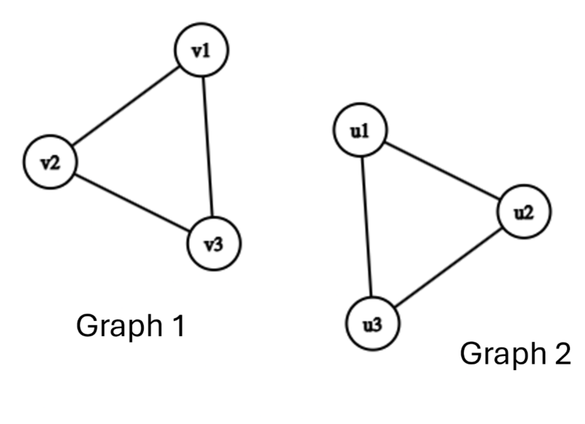
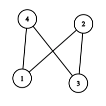
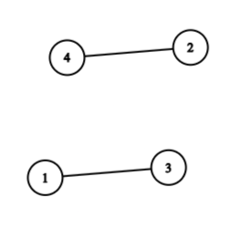
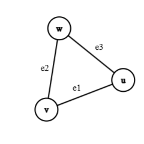
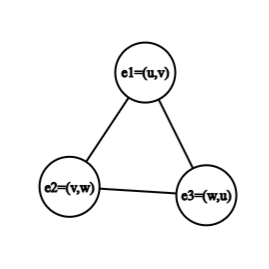
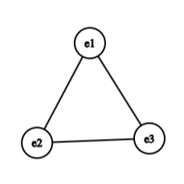
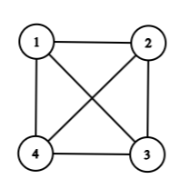
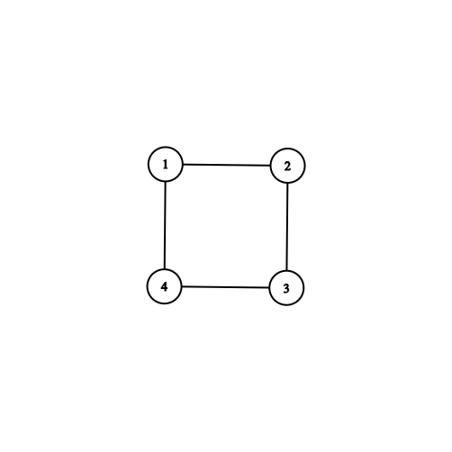
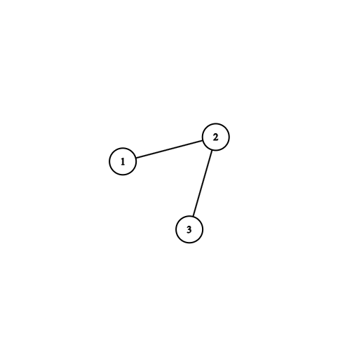

# Graph Types, Operations & Representations

## Graph Isomorphism and Counting

When we draw graphs, we often place vertices in different positions on a page or bend edges around each other. However, graph theory focuses on connectivity rather than spatial layout. Two graphs that look entirely different on paper might actually share the exact same structural connections.

### Graph Isomorphism

Two graphs $G_1 = (V_1, E_1)$ and $G_2 = (V_2, E_2)$ are **isomorphic** (denoted $G_1 \cong G_2$) if there exists a bijection (a one-to-one and onto mapping) $f: V_1 \to V_2$ such that any two vertices $u, v \in V_1$ are adjacent in $G_1$ **if and only if** $f(u)$ and $f(v)$ are adjacent in $G_2$.

In simple terms, an isomorphism is a relabeling of vertices that preserves all connections and non-connections.



#### Invariants Under Isomorphism

If two graphs are isomorphic, they must share structural properties called **graph invariants**. If any of these properties differ, the graphs cannot be isomorphic:

1. The same number of vertices ($\vert{}V_1\vert{} = \vert{}V_2\vert{}$).


2. The same number of edges ($\vert{}E_1\vert{} = \vert{}E_2\vert{}$).


3. The exact same degree sequence (the degrees of all vertices listed in non-increasing order).


4. The same subgraphs, cycles of specific lengths, and structural properties.


#### Example

```{example}
Consider two graphs $G_1$ and $G_2$ with $V_1 = \{1, 2, 3, 4\}$ and $V_2 = \{a, b, c, d\}$.

* $E_1 = \{(1,2), (2,3), (3,4), (4,1)\}$ (a 4-cycle $C_4$)
* $E_2 = \{(a,b), (b,c), (c,d), (d,a)\}$ (a 4-cycle $C_4$)

We can define the bijection $f(1)=a, f(2)=b, f(3)=c, f(4)=d$. Since every edge $(i, j) \in E_1$ corresponds to $(f(i), f(j)) \in E_2$, $G_1 \cong G_2$.
```
*(Note: While checking if two graphs are isomorphic is easy once the mapping $f$ is given, determining whether a mapping exists for two arbitrary large graphs is a famously difficult problem in computer science, known as the Graph Isomorphism problem.)*

---

### Counting Simple Graphs

How many distinct graphs can we form given a fixed set of $n$ vertices?

1. **Maximum Edges in a Simple Graph**:
In a simple graph with $n$ vertices, every vertex can connect to at most $n-1$ other vertices. Counting all pairs gives:

$$\text{Maximum Edges} = \binom{n}{2} = \frac{n(n-1)}{2}$$


2. **Total Labeled Graphs**:
If the $n$ vertices are labeled (distinct), each of the $\frac{n(n-1)}{2}$ potential edges can either be present ($1$) or absent ($0$). Thus, the total number of labeled simple graphs on $n$ vertices is:


$$N_{\text{labeled}} = 2^{\frac{n(n-1)}{2}}$$


3. **Unlabeled (Non-Isomorphic) Graphs**:
If vertices are indistinguishable, we count non-isomorphic equivalence classes $T_n$. Since there are at most $n!$ ways to permute the labels of $n$ vertices, $T_n$ satisfies the bounds:


$$\frac{2^{n(n-1)/2}}{n!} \le T_n \le 2^{n(n-1)/2}$$


---

## Graph Transformations and Operations

We can construct new graphs from existing ones using structural transformations.

### The Complement Graph ($\overline{G}$)

Given a simple graph $G = (V, E)$, its **complement** $\overline{G} = (V, E')$ shares the exact same vertex set $V$, but its edge set $E'$ consists of all edges that are **missing** from $G$.

$$e = (u, v) \in E' \iff e = (u, v) \notin E \quad \text{for } u \neq v$$


|Original Graph $G$|Complement Graph $\bar{G}$|
|:-:|:-:|
|||


#### Properties of Complements

* $G \cup \overline{G} = K_n$ (The union of $G$ and $\overline{G}$ forms the complete graph $K_n$).


* $\vert{}E(G)\vert{} + \vert{}E(\overline{G})\vert{} = \frac{n(n-1)}{2}$.


* A graph $G$ is called **self-complementary** if $G \cong \overline{G}$.


---

### The Line Graph ($L(G)$)

The **line graph** $L(G)$ flips the structural roles of vertices and edges:

* Every **vertex** in $L(G)$ represents an **edge** in $G$.


* Two vertices in $L(G)$ are adjacent **if and only if** their corresponding edges in $G$ share a common endpoint.


|Original Graph $G$ | |Line Graph $L(G)$|
|:-:|:-:|:-:|
||||
#### Example

```{example}
Let $G = P_4$, a path graph with 4 vertices $\{1, 2, 3, 4\}$ and 3 edges $e_1=(1,2), e_2=(2,3), e_3=(3,4)$.

* In $L(G)$, the vertices are $\{e_1, e_2, e_3\}$.
* Edge $e_1$ shares vertex $2$ with $e_2$, so $(e_1, e_2)$ is an edge in $L(G)$.
* Edge $e_2$ shares vertex $3$ with $e_3$, so $(e_2, e_3)$ is an edge in $L(G)$.
* Edge $e_1$ and $e_3$ share no vertices, so there is no edge between $e_1$ and $e_3$.
* Thus, $L(P_4) \cong P_3$.
```
---

## Eulerian and Hamiltonian Graphs

Two classic traversal problems focus on traversing either every **edge** or every **vertex** of a graph.

### Eulerian Graphs (Edge Traversals)

* **Eulerian Trail**: A trail that visits every **edge** of $G$ exactly once.


* **Eulerian Tour (or Circuit)**: A closed Eulerian trail that starts and ends at the same vertex.


* **Eulerian Graph**: A graph that contains an Eulerian tour.

<center>

           
Sequence: 1 $\rightarrow$ 2 $\rightarrow$ 3 $\rightarrow$ 4 $\rightarrow$ 1 $\rightarrow$ 3 $\rightarrow$ 4 $\rightarrow$ 2 $\rightarrow$ 1

</center>

#### Euler's Theorem

```{theorem}
A connected graph $G$ contains an Eulerian tour **if and only if** every vertex in $G$ has an **even degree**.
```

```{theorem,name="Eulerian Trail"}
A connected graph $G$ contains an open Eulerian trail (starting at $u$ and ending at $v$, where $u \neq v$) **if and only if** $u$ and $v$ have **odd degrees**, and all other vertices have **even degrees**.
```
---

### Hamiltonian Graphs (Vertex Traversals)

```{definition}
* **Hamiltonian Path**: A path that visits every **vertex** of $G$ exactly once.


* **Hamiltonian Cycle**: A closed cycle that visits every **vertex** of $G$ exactly once.


* **Hamiltonian Graph**: A graph that contains a Hamiltonian cycle.
```

<center>


Sequence: 1 $\rightarrow$ 2 $\rightarrow$ 3 $\rightarrow$ 4 $\rightarrow$ 1
</center>

#### Eulerian vs. Hamiltonian Summary

| Feature | Eulerian Graph | Hamiltonian Graph |
| --- | --- | --- |
| **Core Requirement** | Traverses every **edge** exactly once | Visits every **vertex** exactly once |
| **Characterization** | Exact necessary & sufficient conditions known (Degree parity)| No known simple characterization (NP-complete problem)|
| **Verification** | Simple degree-counting algorithm| Computationally difficult for large graphs |

---

## Computer Representations of Graphs

To analyse graphs computationally, we must store their structure using concrete data structures.

|Graph $G$|Adjacency Matrix $A$|
|:-:|:-:|
||\[
\begin{array}{c|ccc}
\text{Vertices:} & 1 & 2 & 3 \\ \hline
1 & 0 & 1 & 1 \\
2 & 1 & 0 & 1 \\
3 & 1 & 1 & 0
\end{array}
\]|


### The Adjacency Matrix ($A$)

For a graph $G = (V, E)$ with $n$ labeled vertices $\{1, 2, \dots, n\}$, the **adjacency matrix** $A$ is an $n \times n$ matrix where:

$$A(i, j) = \begin{cases} 1 & \text{if } (i, j) \in E \\ 0 & \text{if } (i, j) \notin E \end{cases}$$

#### Matrix Properties

* **Undirected Graphs**: $A$ is symmetric ($A(i, j) = A(j, i)$). The sum of entries in row $i$ equals the degree $d(v_i)$.


* **Simple Graphs**: The diagonal entries $A(i, i) = 0$ because simple graphs have no self-loops.
* **Paths of Length $k$**: The entry $A^k(i, j)$ in the $k$-th matrix power gives the exact number of distinct walks of length $k$ between vertex $i$ and vertex $j$.

---

### The Incidence Matrix ($T$)

For a graph with $n$ vertices and $m$ edges, the **incidence matrix** $T$ is an $n \times m$ matrix mapping vertices (rows) directly to edges (columns).

#### Undirected Graphs

$$T(i, k) = \begin{cases} 1 & \text{if vertex } i \text{ is incident with edge } k \\ 0 & \text{otherwise} \end{cases}$$

#### Directed Graphs (Digraphs)

$$T(i, k) = \begin{cases} -1 & \text{if directed edge } k \text{ leaves vertex } i \\ 1 & \text{if directed edge } k \text{ enters vertex } i \\ 0 & \text{if vertex } i \text{ is not incident with edge } k \end{cases}$$

#### Example 2.3

Consider a directed graph with vertices $\{v_1, v_2, v_3\}$ and edges $e_1 = (v_1, v_2), e_2 = (v_2, v_3), e_3 = (v_1, v_3)$:

$$\text{Incidence Matrix } T = \begin{pmatrix}  e_1 & e_2 & e_3 \\ -1 & 0 & -1 \\  1 & -1 & 0 \\  0 & 1 & 1  \end{pmatrix}$$

---

### The Adjacency List

An **adjacency list** maintains an array or list of size $n$, where each entry $i$ points to a list of all vertices adjacent to vertex $i$.

| Vertex | Neighbors            |
|--------|-----------------------|
| 1      | -$\rightarrow$ [2] $\rightarrow$ [3] |
| 2      | -$\rightarrow$ [1] $\rightarrow$ [3] |
| 3      | -$\rightarrow$ [1] $\rightarrow$ [2] |


### Representation Comparison

| Representation | Memory Complexity | Edge Lookup $(u, v)$ | Ideal Use Case |
| --- | --- | --- | --- |
| **Adjacency Matrix** | $O(n^2)$<br> | $O(1)$ constant time| **Dense Graphs** (where $\vert{}E\vert{} \approx n^2$)|
| **Incidence Matrix** | $O(n \cdot m)$<br> | $O(m)$ search time| **Theoretical Algorithms & Flows**<br> |
| **Adjacency List** | $O(n + m)$<br> | $O(d(u))$ list search time| **Sparse Graphs** (where $\vert{}E\vert{} \ll n^2$) |

---

## Chapter 2 Exercises

```{exercise}
1. **Graph Isomorphism**: Are $K_{3,3}$ and a cycle $C_6$ with extra cross-edges isomorphic? List two graph invariants you can use to justify your answer.
2. **Complement Construction**: Draw the complement of a path graph $P_4$. Is $P_4$ self-complementary?
3. **Eulerian vs Hamiltonian**: Construct a graph that contains an Eulerian circuit but does **not** contain a Hamiltonian cycle.
4. **Adjacency Matrix Powers**: Given the adjacency matrix $A = \begin{pmatrix} 0 & 1 & 1 \\ 1 & 0 & 1 \\ 1 & 1 & 0 \end{pmatrix}$, compute $A^2$ and interpret what the entry $A^2(1, 1)$ represents.
```