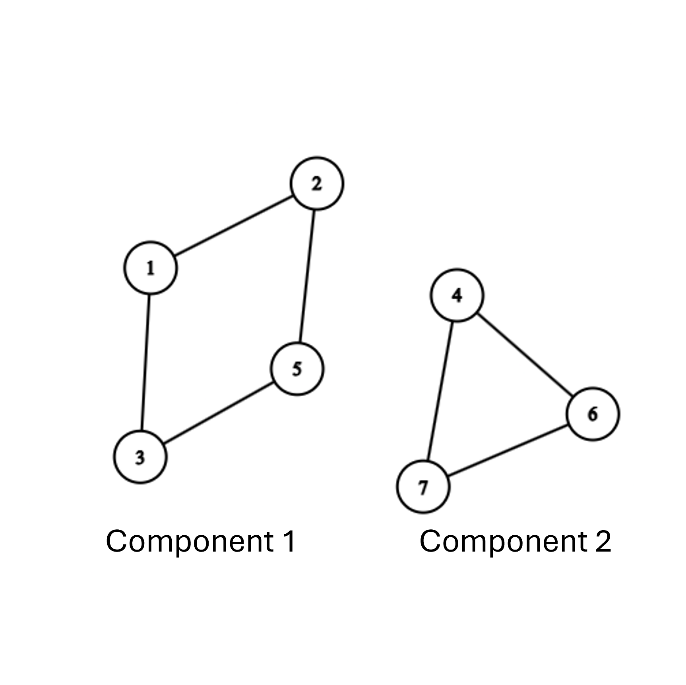
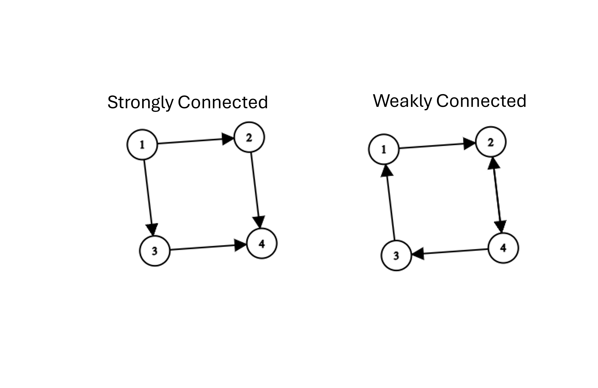
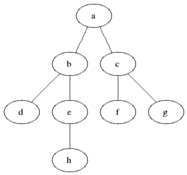

# Chapter 3: Connectivity & Graph Exploration

## 3.1 Graph Connectivity

Understanding how vertices are linked to one another is a fundamental concept in graph theory. Connectivity determines whether information, traffic, or signals can flow between different points in a network.

### Connectivity in Undirected Graphs

In an undirected graph $G = (V, E)$, two vertices $u$ and $v$ are connected if there exists a walk between them.

* **Reachability Relation ($\sim$)**: We define a relation $u \sim v$ if there exists a walk starting at vertex $u$ and ending at vertex $v$.


* **Equivalence Classes**: The relation $\sim$ is an equivalence relation because it satisfies three key properties:


1. **Reflexive**: $u \sim u$ (a trivial walk of length $0$ exists from $u$ to itself).


2. **Symmetric**: If $u \sim v$, then $v \sim u$ (since edges in undirected graphs can be traversed in either direction).


3. **Transitive**: If $u \sim v$ and $v \sim w$, then $u \sim w$ (by concatenating the two walks).


Because $\sim$ is an equivalence relation, it partitions the set of vertices $V$ into disjoint equivalence classes called **connected components**.



A graph is **connected** if it consists of exactly one connected component (meaning every vertex can reach every other vertex). Otherwise, it is **disconnected**.

---

### Strong Connectivity in Directed Graphs

In directed graphs (digraphs), edge directions matter. The existence of a path from $u$ to $v$ does not guarantee a path from $v$ to $u$.

* **Strong Connectivity**: Two vertices $u$ and $v$ in a digraph are **strongly connected** if there exists a directed walk from $u$ to $v$ **and** a directed walk from $v$ to $u$.


* **Strongly Connected Component (SCC)**: A maximal subgraph where every pair of vertices is mutually reachable.




#### Computing Strongly Connected Components

To formally define the SCC containing a vertex $u$, denoted as $C(u)$, we look at two reaching sets:

1. **Forward Reachable Set ($R_+(u)$)**: The set of all vertices $v$ reachable from $u$ via directed paths.


2. **Backward Reachable Set ($R_-(u)$)**: The set of all vertices $v$ that can reach $u$ via directed paths.


The strongly connected component of $u$ is the intersection of these two sets:


$$C(u) = R_+(u) \cap R_-(u)$$

```
                 R+(u): Nodes u can reach
                          \
                           \  Intersection: C(u)
                            v /
                           ( u )
                            ^ \
                           /   \
                          /     v
                 R-(u): Nodes that can reach u

```

**Algorithmic Insight**: Computing $R_+(u)$ is straightforward—we run a standard search starting at $u$. To compute $R_-(u)$, we find all nodes that can reach $u$ in $G$, which is equivalent to finding all nodes reachable **from** $u$ in the **transpose graph $G^T$** (where every directed edge is reversed). Matrix-wise, $G^T$ corresponds to the transpose of the adjacency matrix, $A^T$.

---

## Graph Exploration Algorithms

Graph exploration algorithms systematically visit the vertices and edges of a graph. They form the foundation for solving complex problems such as finding shortest paths, cycle detection, and identifying connected components.

### Generic Search Algorithm

The generic search algorithm maintains a set $L$ of candidate vertices to explore.

#### Generic Search Steps

1. Initialize a set of discovered vertices $L = \{s\}$, where $s$ is the starting vertex. Mark $s$ as visited.


2. While $L$ is not empty:
* Select an arbitrary vertex $u \in L$.


* Find an unvisited neighbor $v$ adjacent to $u$.


* If such a $v$ exists, mark $v$ as visited and add $v$ to $L$.


* If no unvisited neighbors exist for $u$, remove $u$ from $L$.


* **Complexity**: Takes $O(V)$ main steps, but the specific execution order depends entirely on the data structure used to manage $L$.


---

### Depth-First Search (DFS)

Depth-First Search explores a graph by going as deep as possible along each branch before backtracking.

* **Data Structure**: Last-In, First-Out (**LIFO**) Stack (or recursion).


* **Strategy**: Pick a start vertex, move to an unvisited neighbor, and immediately continue exploring from that new neighbor. When a vertex has no unvisited neighbors, backtrack to the previous vertex.


```
                     DFS Exploration Order
                              (1)
                             /   \
                           [1]   [4]
                           /       \
                         (2)       (4)
                        /
                      [2]
                      /
                    (3)

```


#### DFS Algorithm Steps

1. Push the starting vertex $s$ onto the stack.
2. While the stack is not empty:
* Pop the top vertex $u$.
* If $u$ is not visited, mark it as visited.
* Push all unvisited neighbors of $u$ onto the stack.


* **Time Complexity**: $O(V + E)$ when using an adjacency list.
* **Primary Applications**: Detecting cycles, topological sorting, finding strongly connected components, and pathfinding in mazes.

---

### Breadth-First Search (BFS)

Breadth-First Search explores the graph layer-by-layer, visiting all immediate neighbors of a vertex before moving deeper.

* **Data Structure**: First-In, First-Out (**FIFO**) Queue.


* **Strategy**: Visit the starting node, then visit all of its direct neighbors (distance 1), then all neighbors of those neighbors (distance 2), and so on.


```
                     BFS Exploration Order
                              (1)  <-- Level 0
                             /   \
                           [1]   [1]
                           /       \
                         (2)-------(3) <-- Level 1
                          |
                         [2]
                          |
                         (4)           <-- Level 2

```
<center>


Black = explored, grey = queued to be explored later on
</center>

#### BFS Algorithm Steps

1. Enqueue the starting vertex $s$ into the queue and mark it as visited.
2. While the queue is not empty:
* Dequeue the front vertex $u$.
* For each unvisited neighbor $v$ of $u$:
* Mark $v$ as visited.
* Enqueue $v$.


* **Time Complexity**: $O(V + E)$ when using an adjacency list.
* **Primary Applications**: Finding the shortest path in unweighted graphs, finding connected components, and computing graph diameter.


---

## Comparison of Exploration Algorithms

| Algorithm | Data Structure | Traversal Strategy | Edge Types Discovered | Time Complexity |
| --- | --- | --- | --- | --- |
| **Generic Search** | Unordered Set $L$<br> | Arbitrary selection| General reachability | $O(V)$ main steps |
| **DFS** | LIFO Stack | Deep exploration via backtracking| Tree edges, Back edges, Forward edges, Cross edges | $O(V + E)$ |
| **BFS** | FIFO Queue | Level-by-level exploration | Tree edges, Cross edges | $O(V + E)$ |

---

## Chapter 3 Exercises

1. **Strongly Connected Components**: Given a directed graph $G$, explain why taking the intersection $R_+(u) \cap R_-(u)$ guarantees that all vertices in the resulting set belong to the same strongly connected component.


2. **Algorithm Execution**: Trace both BFS and DFS on a simple cycle graph $C_5$ starting at vertex $v_1$. List the order in which vertices are visited for each algorithm.
3. **Shortest Paths**: Prove that the tree generated by running Breadth-First Search (BFS) on an unweighted graph provides the shortest path (in terms of edge count) from the start vertex to all other reachable vertices.


4. **Graph Transpose**: Show that if $A$ is the adjacency matrix of a digraph $G$, then the transpose matrix $A^T$ represents the graph $G^T$ where all edge directions are reversed.

