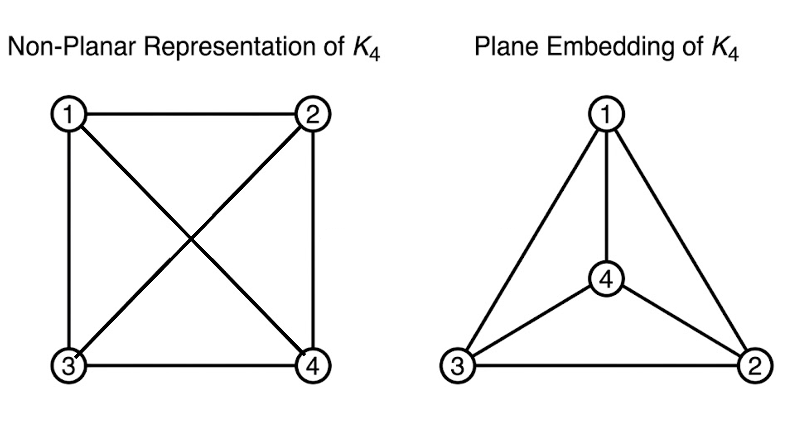
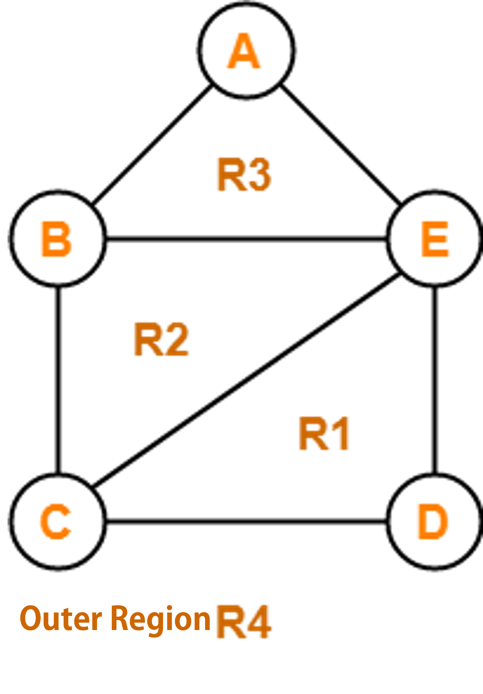
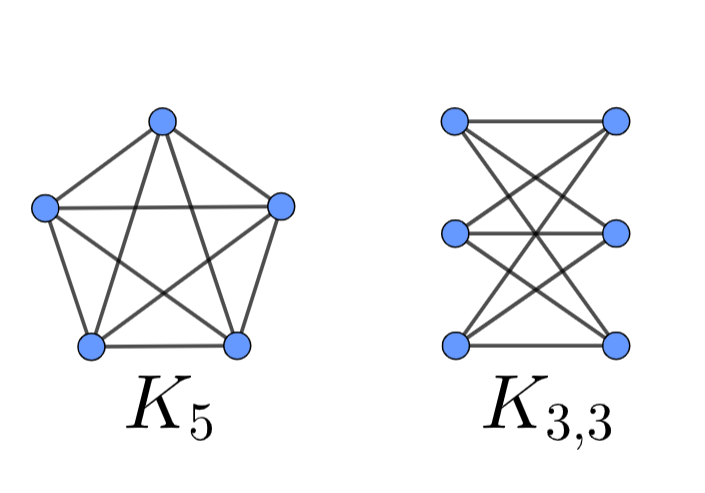
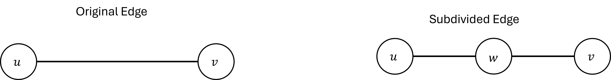

# Planar Graphs

## Planarity and Embeddings

In real-world applications—such as designing printed circuit boards (PCBs), microchip layouts, and urban road networks—it is often necessary to draw or construct a graph without any edges crossing over one another.

### Definitions

```{definition}
* **Planar Graph**: A graph that can be drawn in a two-dimensional plane such that no two edges intersect except at a common vertex.


* **Plane Graph (Plane Embedding)**: A specific drawing of a planar graph on a plane where no edges cross.
```




*(Note: $K_4$ drawn with crossed diagonal edges is still a planar graph because it is isomorphic to a plane embedding where one vertex is pulled outside.)*

### Fáry's Theorem

A natural question arises: if a graph can be drawn without crossing edges using curved lines, can it also be drawn using only straight lines?

```{theorem,name="Fáry's Theorem, 1948"}

Every simple planar graph can be embedded in the plane using straight-line segments for all of its edges.
```
---

## Euler's Formula and Regions

```{definition}
When a planar graph is drawn as a plane graph, its edges divide the plane into contiguous, enclosed areas called **regions** (or faces).

* **Boundary of a Region**: The set of edges enclosing that region.
* **Unbounded (Outer) Region**: The single infinite region surrounding the entire drawing. Every plane graph has exactly one outer region.
```

{width=30%}

In the plane graph above, there are 5 vertices ($v=5$), 6 edges ($e=6$), and 3 bounded regions plus 1 unbounded outer region, giving 4 total regions ($r=4$).

---

### Euler's Formula

The fundamental relationship connecting the number of vertices, edges, and regions of a planar graph was discovered by Leonhard Euler.

```{theorem,name="Euler's Formula"}

For any connected plane graph with $v$ vertices, $e$ edges, and $r$ regions:

$$v - e + r = 2$$
```

#### Generalized Euler's Formula

If a planar graph is disconnected and consists of $c$ connected components, the formula generalizes to:


$$v - e + r = c + 1$$

#### Proof of Euler's Formula (By Induction on Edges)
```{proof}
* **Base Case**:

Consider a connected graph with no cycles (a tree). A tree on $v$ vertices has $e = v - 1$ edges and creates no enclosed areas, leaving only $1$ outer region ($r = 1$).


$$v - (v - 1) + 1 = 2$$


The formula holds for the base case.

* **Inductive Step**:

Assume $v - e + r = 2$ holds for all connected plane graphs with $k$ edges. Let $G$ be a connected plane graph with $k + 1$ edges.

  1. Since $G$ is not a tree, it must contain at least one cycle.
  2. Select an edge $e^*$ that belongs to a cycle. Removing $e^*$ breaks the cycle, merging two adjacent regions into one.
  3. The new graph $G' = G \setminus \{e^*\}$ has $v'=v$ vertices, $e'=e-1$ edges, and $r'=r-1$ regions.
  4. By the induction hypothesis, $v' - e' + r' = 2$.
  5. Substituting the values: $v - (e - 1) + (r - 1) = 2 \implies v - e + r = 2$.

By mathematical induction, Euler's formula holds for all connected plane graphs.
```
---

## Invariants and Non-Planarity Bounds

Euler's formula allows us to derive strict upper bounds on how many edges a simple graph can have while remaining planar.

### Edge Bounds for Simple Planar Graphs

```{theorem,name="General Edge Bound"}

In any simple connected planar graph with $v \ge 3$ vertices and $e$ edges:


$$e \le 3v - 6$$
```

```{proof}

1. Every region in a simple planar graph must be bounded by at least 3 edges (since a simple graph has no self-loops or double edges, the smallest cycle length is 3).
2. Summing the degree of all regions gives $\sum \text{deg}(r_i) \ge 3r$.
3. Since every edge bounds at most 2 regions, $\sum \text{deg}(r_i) = 2e$. Thus, $2e \ge 3r \implies r \le \frac{2}{3}e$.
4. Substitute $r \le \frac{2}{3}e$ into Euler's formula ($v - e + r = 2$):

$$v - e + \frac{2}{3}e \ge 2 \implies v - \frac{1}{3}e \ge 2 \implies e \le 3v - 6$$

```

---

```{theorem,name="Girth Bound"}

If a simple planar graph has a **girth** (length of its shortest cycle) of at least 4 (i.e., it contains no triangles), then:


$$e \le 2v - 4$$
```

```{proof}

Since the graph has no triangles, every region is bounded by at least 4 edges. Therefore, $2e \ge 4r \implies r \le \frac{1}{2}e$.
Substituting this into Euler's formula gives $v - e + \frac{1}{2}e \ge 2 \implies e \le 2v - 4$.
```

---

### Degree Bounds

```{theorem}

Every simple planar graph contains at least one vertex with degree $d(v) \le 5$.
```

```{proof}

Suppose every vertex in a simple planar graph $G$ has degree $d(v) \ge 6$.
By the Handshaking Lemma:


$$2e = \sum d(v) \ge 6v \implies e \ge 3v$$


However, Theorem 1 states that $e \le 3v - 6$, creating a direct contradiction ($3v \le e \le 3v - 6$). Therefore, $G$ must contain at least one vertex with $d(v) \le 5$.
```
---

## Characterizing Non-Planar Graphs

Not all graphs are planar. The two canonical non-planar graphs are:

1. **$K_5$**: The complete graph on 5 vertices.


2. **$K_{3,3}$**: The complete bipartite graph on 3+3 vertices (often called the *utility graph*).





### Proving Non-Planarity


```{example,name="$K_5$ is Non-Planar"}

For $K_5$, $v = 5$ and $e = \binom{5}{2} = 10$.
Using Theorem 1 ($e \le 3v - 6$):


$$10 \le 3(5) - 6 = 9 \quad \text{(False)}$$


Since $10 \le 9$ is false, $K_5$ cannot be planar.

```

```{example,name="$K_{3,3}$ is Non-Planar"}

For $K_{3,3}$, $v = 6$ and $e = 3 \times 3 = 9$.
Since $K_{3,3}$ is bipartite, it contains no odd cycles (girth $\ge 4$). Using Theorem 2 ($e \le 2v - 4$):


$$9 \le 2(6) - 4 = 8 \quad \text{(False)}$$


Since $9 \le 8$ is false, $K_{3,3}$ cannot be planar.
```

---

### Kuratowski's Theorem

How can we determine if an arbitrary complex graph is planar?

* **Edge Subdivision**: Inserting a vertex of degree 2 into an edge, splitting it into two adjacent edges.
* **Subdivision of a Graph**: A graph obtained by performing a sequence of edge subdivisions on $G$.



```{theorem ,name="Kuratowski's Theorem(1930)"}

A finite graph is planar **if and only if** it does not contain a subgraph that is a subdivision of $K_5$ or $K_{3,3}$.
```
---

## Chapter 4 Summary Table

| Property / Bound | Formula / Condition | Context / Application |
| --- | --- | --- |
| **Euler's Formula** | $v - e + r = 2$<br> | Connected plane graphs |
| **General Edge Bound** | $e \le 3v - 6$<br> | Simple planar graphs ($v \ge 3$) |
| **Triangle-Free Edge Bound** | $e \le 2v - 4$<br> | Planar graphs with girth $\ge 4$<br> |
| **Minimum Degree Invariant** | $\min d(v) \le 5$<br> | All simple planar graphs |
| **Non-Planarity Criterion** | Subdivisions of $K_5$ or $K_{3,3}$<br> | Kuratowski's Theorem |

---

## Chapter 4 Exercises

1. **Euler's Formula Application**: A connected plane graph has 12 vertices, and every vertex has degree 3. How many edges and regions does the graph have?
2. **Polyhedron Proof**: Prove that no convex polyhedron can be constructed such that every face is bounded by 6 or more edges.
3. **Planarity Verification**: A simple planar graph $G$ has 10 vertices and is bipartite. What is the maximum number of edges $G$ can have?
4. **Kuratowski Subdivision**: Draw $K_5$ and subdivide one of its edges by adding a new vertex. Is the resulting graph planar? Explain using Kuratowski's Theorem.


