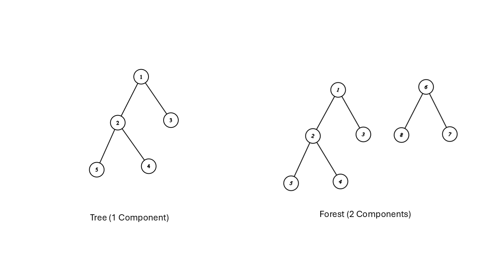
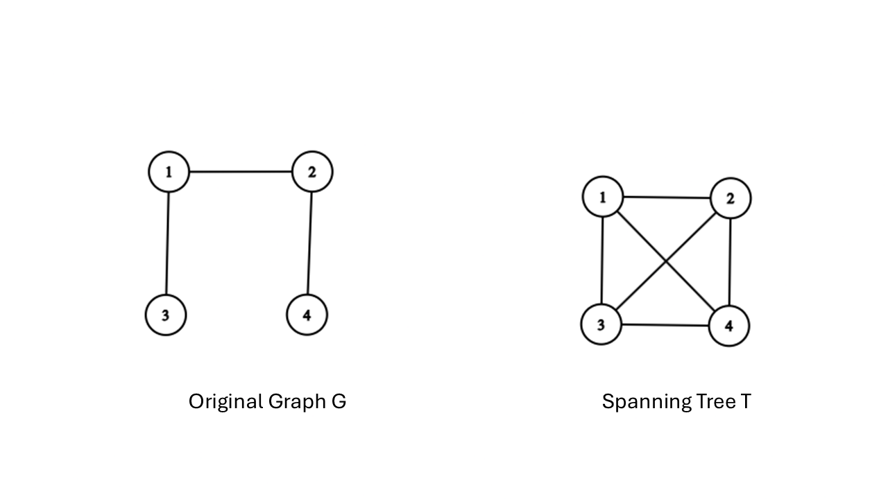

# Trees & Spanning Trees

## Basic Properties of Trees

Trees are among the most fundamental and heavily utilized graph structures in mathematics and computer science. They represent minimally connected networks and form the backbone of hierarchical structures, search algorithms, and data structures.

### Definitions
```{definition}
* **Tree**: A connected, undirected simple graph that contains no cycles (an acyclic connected graph).
* **Forest**: An acyclic graph whose connected components are trees.
* **Leaf (Terminal Vertex)**: A vertex of degree 1 in a tree.
* **Internal Vertex**: A vertex of degree greater than 1.
```




--

### Equivalent Characterizations of Trees

For any simple graph $T = (V, E)$ with $n$ vertices, the following statements are logically equivalent:

1. $T$ is a tree (connected and acyclic).
2. $T$ is connected and has exactly $n - 1$ edges.
3. $T$ is acyclic and has exactly $n - 1$ edges.
4. There exists a **unique simple path** between every pair of vertices in $T$.
5. $T$ is minimally connected: removing any edge disconnects $T$ (every edge is a bridge).
6. $T$ is maximally acyclic: adding any edge between non-adjacent vertices creates exactly one cycle.

#### Proof Sketch: Every Tree Has $n - 1$ Edges

**Proof (By Induction on $n$):**

* **Base Case ($n=1$):** A tree with $1$ vertex has $0$ edges ($1 - 1 = 0$). The base case holds.
* **Inductive Step:** Assume every tree with $k$ vertices has $k - 1$ edges. Let $T$ be a tree with $k + 1$ vertices ($k \ge 1$).
1. Since $T$ is connected and acyclic, $T$ must contain at least one leaf vertex $v$ with $d(v) = 1$.
2. Remove $v$ and its single incident edge $e$. The resulting graph $T' = T \setminus \{v\}$ remains connected and acyclic, so $T'$ is a tree on $k$ vertices.
3. By the inductive hypothesis, $T'$ has $k - 1$ edges.
4. Adding $v$ and $e$ back gives $T$ a total of $(k - 1) + 1 = k$ edges.


By induction, every tree with $n$ vertices contains $n - 1$ edges.

---

## Spanning Trees

When analyzing a connected graph, we often seek a minimal connected backbone that preserves reachability while eliminating redundant cycles.

### Definition

```{definition}
Given a connected graph $G = (V, E)$, a **spanning tree** $T = (V, E')$ is a subgraph that is a tree and contains **all** vertices of $G$ ($V(T) = V(G)$).
```





#### Key Properties

* A graph $G$ has a spanning tree **if and only if** $G$ is connected.
* If $G$ has $n$ vertices and $m$ edges, any spanning tree $T$ selects exactly $n - 1$ edges.
* The $m - (n - 1)$ edges present in $G$ but omitted from $T$ are called **cotree edges** (or chords).

---

### Counting Spanning Trees

#### Cayley's Formula (Labeled Trees)

How many distinct labeled spanning trees can be constructed on $n$ vertices?

```{theorem,name="Cayley's Formula, 1889"}

The number of distinct labeled trees on $n$ vertices (or the number of spanning trees of the complete graph $K_n$) is:


$$\tau(K_n) = n^{n-2}$$
```

```{example}
* For $n = 3$: $\tau(K_3) = 3^{3-2} = 3$ spanning trees.
* For $n = 4$: $\tau(K_4) = 4^{4-2} = 16$ spanning trees.
```


---

#### The Matrix-Tree Theorem (Kirchhoff's Theorem)

To compute the exact number of spanning trees $\tau(G)$ for an **arbitrary** simple graph $G$, we use its Laplacian Matrix.

```{definition ,name="Laplacian Matrix $L$"}

Given a graph with $n$ vertices, its Laplacian matrix $L$ is defined as:


$$L = D - A$$


where $D$ is the diagonal degree matrix ($D_{ii} = d(v_i)$) and $A$ is the adjacency matrix.

$$L_{i,j} = \begin{cases} d(v_i) & \text{if } i = j \\ -1 & \text{if } i \neq j \text{ and } (v_i, v_j) \in E \\ 0 & \text{otherwise} \end{cases}$$
```

```{theorem,name="Kirchhoff's Matrix-Tree Theorem"}

For any connected graph $G$, the number of spanning trees $\tau(G)$ equals the absolute value of **any cofactor** of its Laplacian matrix $L$.

$$\tau(G) = \det(L_{i,j})$$


*(where $L_{i,j}$ is the submatrix formed by deleting row $i$ and column $j$ from $L$)*.
```
---

## Fundamental Cycles and Cutsets

Spanning trees provide a structured coordinate system for analyzing cycles and cuts in a graph.

### Fundamental Cycles

Let $T$ be a spanning tree of a connected graph $G = (V, E)$.

* Adding any non-tree edge $e \in E \setminus E(T)$ to $T$ creates **exactly one cycle**.
* This cycle is called the **fundamental cycle** associated with edge $e$.
* Since there are $m - (n - 1)$ non-tree edges, $T$ defines a basis of $m - n + 1$ fundamental cycles.

```
  Spanning Tree T (Solid) + Non-Tree Edge e (Dashed) -> Fundamental Cycle
                     (1)-----------(2)
                      |             |
                      |  e (dashed) |
                      |  . . . . .  |
                      | .          .|
                     (3)-----------(4)

```

---

### Fundamental Cutsets

Removing any tree edge $e \in E(T)$ splits $T$ into two disconnected components with vertex sets $V_1$ and $V_2$.

* The set of all edges in $G$ that connect a vertex in $V_1$ to a vertex in $V_2$ forms a **fundamental cutset** (or fundamental edge cut) associated with $e$.
* Each fundamental cutset contains **exactly one** edge from the spanning tree $T$.

---

## Minimum Spanning Trees (MST)

In weighted networks—such as fiber-optic cabling, electrical grids, or transportation routes—each edge $e$ has an associated cost or weight $w(e)$.

### The Minimum Spanning Tree Problem

Given a connected, weighted graph $G = (V, E, w)$, find a spanning tree $T$ that minimizes the total edge weight:


$$w(T) = \sum_{e \in E(T)} w(e)$$

---

### Key Theoretical Properties of MSTs

1. **Cut Property:**
For any cut $(S, V \setminus S)$ of $G$, the lightest edge $e$ crossing the cut must belong to **every** Minimum Spanning Tree of $G$.
2. **Cycle Property:**
For any cycle $C$ in $G$, the heaviest edge $e$ in $C$ cannot belong to **any** Minimum Spanning Tree (assuming edge weights are distinct).
3. **Uniqueness:**
If all edge weights in $G$ are distinct, $G$ has a **unique** Minimum Spanning Tree.

---

### Greedy MST Algorithms

#### Kruskal's Algorithm (Edge-Centric)

Kruskal's algorithm builds the MST by adding edges in increasing order of weight, avoiding cycles at every step.

```
                     Kruskal's Algorithm Step
  1. Sort all edges by weight.
  2. Pick the smallest edge. If it forms a cycle with the 
     current forest, discard it; otherwise, add it.
  3. Repeat until n - 1 edges are selected.

```

* **Data Structure:** Disjoint-Set Union (DSU / Find-Union).
* **Time Complexity:** $O(E \log E)$ or $O(E \log V)$ due to edge sorting.

---

#### Prim's Algorithm (Vertex-Centric)

Prim's algorithm grows a single tree component outwards from an arbitrary starting vertex.

```
                      Prim's Algorithm Step
  1. Start with a single vertex in tree set S.
  2. Find the minimum-weight edge (u, v) such that u in S and v not in S.
  3. Add v to S and include (u, v) in the tree.
  4. Repeat until S contains all vertices.

```

* **Data Structure:** Priority Queue / Binary Heap.
* **Time Complexity:** $O(E \log V)$ with a binary heap, or $O(E + V \log V)$ using a Fibonacci heap.

---

## Chapter 5 Comparison Table

| Algorithm / Theorem | Strategy / Core Idea | Primary Output / Complexity |
| --- | --- | --- |
| **Cayley's Formula** | Combinatorial enumeration ($n^{n-2}$) | Number of labeled trees on $n$ vertices |
| **Kirchhoff's Theorem** | Determinant of Laplacian submatrix ($\det L_{i,j}$) | Exact count of spanning trees for any graph $G$ |
| **Kruskal's Algorithm** | Global edge sorting + Disjoint Sets | Minimum Spanning Tree in $O(E \log V)$ time |
| **Prim's Algorithm** | Local tree expansion + Priority Queue | Minimum Spanning Tree in $O(E \log V)$ time |

---

## Chapter 5 Exercises

1. **Tree Bounds**: Prove that every tree with $n \ge 2$ vertices has at least 2 leaves.
2. **Cayley's Formula Application**: How many distinct spanning trees can be formed from the complete graph $K_5$?
3. **Laplacian Matrix Computation**: Construct the Laplacian matrix $L$ for a cycle graph $C_4$ and use Kirchhoff's Matrix-Tree Theorem to compute its total number of spanning trees.
4. **MST Execution**: Given a graph $G$ with vertices $\{A, B, C, D\}$ and weighted edges $(A,B)=2, (B,C)=3, (A,C)=1, (C,D)=4, (B,D)=5$, trace both Kruskal's and Prim's algorithms step-by-step to construct the MST.
