--- 
title: "Graph Theory"
author: "Ashan De Silva"
date: "`r Sys.Date()`"
site: bookdown::bookdown_site
documentclass: book
bibliography: [references.bib]
url: https://ashanjayamal.github.io/graph-theory/
cover-image: fig/cover.png
description: |
  Notes for undergraduate studies in Graph Theory.
link-citations: yes
github-repo: rstudio/bookdown-demo
---

# Introduction to Graph Theory

## What is Graph Theory?

At its core, **graph theory** is the study of relationships. Whenever we have a collection of objects and connections between them, we can use a graph to model, analyze, and solve problems involving that structure.

Unlike the graphs you might recall from introductory algebra (like $y = x^2$ or sine waves), a graph in discrete mathematics is a structural map. It consists of individual points and the lines that connect them.


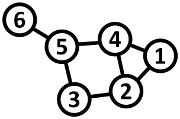

The objects are represented as points called **vertices** (or **nodes**), and the connections between them are called **edges**.
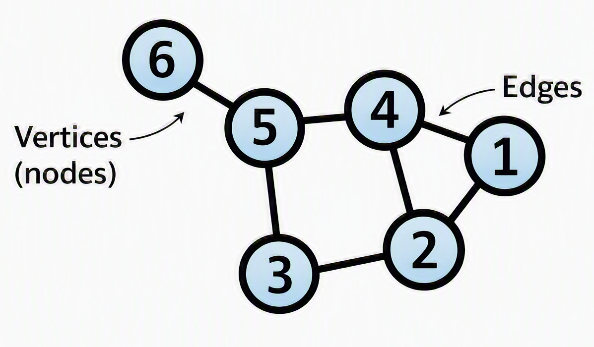{width=50%}

Graphs give us a unified mathematical language to represent networks. Whether we are analyzing social networks, computer communication grids, or transit maps, graph theory provides the core framework to understand how systems are connected.

---

## Historical Foundations

To appreciate graph theory, it helps to understand the historical puzzles that sparked its development.

### The Seven Bridges of Königsberg (1736)

Graph theory was born in the Prussian city of Königsberg (now Kaliningrad, Russia). The city was divided by the Pregel River, creating two large islands connected to each other and to the mainland riverbanks by seven bridges.

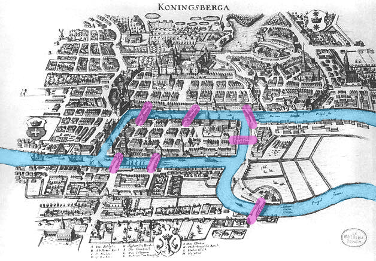

The citizens posed a classic recreational puzzle: *Is it possible to take a walk through the city in such a way that you cross every single one of the seven bridges exactly once, and end up back where you started?*


In 1736, the Swiss mathematician **Leonhard Euler** solved this problem. He realized that the specific distances, land shapes, and physical geography did not matter; only the **connections** mattered. Euler simplified the map by replacing each landmass with a point (vertex) and each bridge with a line (edge).

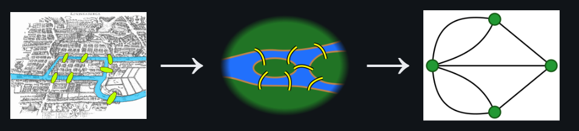

By abstracting the geography into a mathematical structure, Euler proved that such a walk was impossible. In doing so, he laid the foundation for topology and graph theory.

### Hamilton’s Icosian Game (1859)

Over a century later, in 1859, Irish mathematician **Sir William Rowan Hamilton** created a commercial puzzle called the *Icosian Game*.

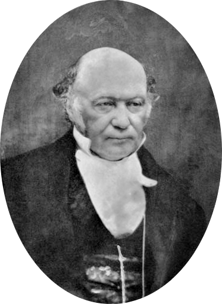


The game used a solid wooden regular dodecahedron—a 12-faced polyhedron with 20 corners. Each of the 20 corners was labeled with the name of a famous world city. The objective was to find a route along the edges of the dodecahedron that visited **every city exactly once** and returned to the starting point.


While Euler’s bridge problem focused on visiting every *edge* once, Hamilton’s game focused on visiting every *vertex* once. These two historical problems led directly to two major areas of graph theory: **Eulerian paths** and **Hamiltonian cycles**.

---

## Modern Applications

Today, graph theory is an essential foundation for computer science, data analytics, and operational engineering.

* **Social Networks**: Platforms model users as vertices and friendships or followers as edges. Graph theory algorithms help identify tight-knit communities, influential users, and recommendation loops.


* **Transportation Networks**: Airline routes, train networks, and road grids are modeled as graphs. GPS platforms rely on these models to compute optimal routes.


* **The Web & PageRank**: The World Wide Web is a massive graph where web pages are vertices and hyperlinks are directed edges. Early search engines transformed web searches by using graph structure to rank relevance based on link density.


---

## Formal Definitions and Basic Structures

Let us establish the formal mathematical definitions used throughout graph theory.

### Mathematical Definition of a Graph

A **graph** $G$ is a pair $G = (V, E)$, where:

* $V$ is a non-empty set of **vertices** (or nodes).
* $E$ is a set of **edges**, where each edge $e \in E$ is associated with an unordered pair of vertices $\{u, v\} \subseteq V$.

If an edge $e$ connects vertices $u$ and $v$, we write $e = (u, v)$ or $e = uv$. We say that $e$ is **incident** with $u$ and $v$, and that $u$ and $v$ are **adjacent** (or neighbors).

#### Example 

```{example}
Consider a graph $G = (V, E)$ defined by:

* $V = \{v_1, v_2, v_3, v_4, v_5\}$
* $E = \{e_1, e_2, e_3, e_4, e_5, e_6\}$ where:
* $e_1 = (v_1, v_2)$
* $e_2 = (v_2, v_3)$
* $e_3 = (v_3, v_4)$
* $e_4 = (v_4, v_1)$
* $e_5 = (v_1, v_3)$
* $e_6 = (v_4, v_5)$

```
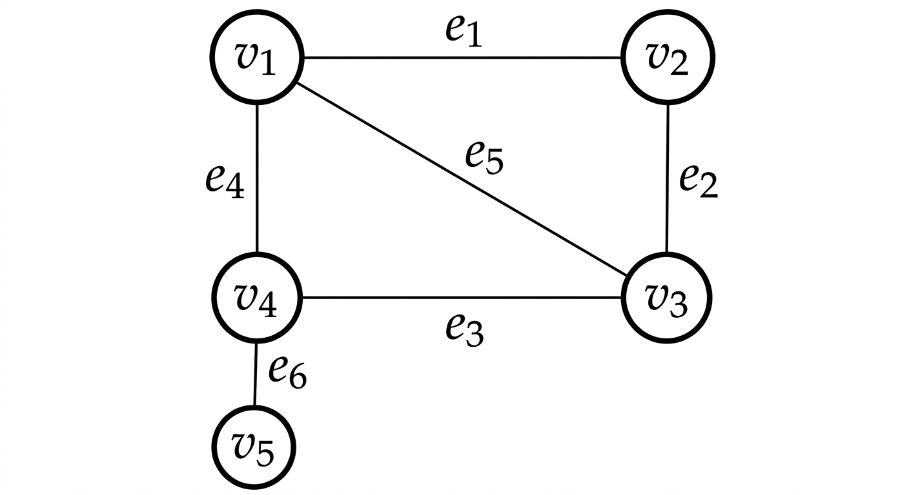

In this graph:

* $v_1$ and $v_3$ are adjacent because $e_5 = (v_1, v_3)$ connects them.
* $v_2$ and $v_5$ are **not** adjacent because there is no edge directly connecting them.

---

### Loops, Multiple Edges, and Simple Graphs

Not all graphs are strictly constructed with single lines between distinct points.

* **Self-loop**: An edge that joins a vertex to itself (e.g., $e = (v_1, v_1)$).
* **Multiple Edges (Parallel Edges)**: A collection of two or more edges that connect the exact same pair of distinct end vertices.
* **Simple Graph**: A graph that contains **no self-loops and no multiple edges**.

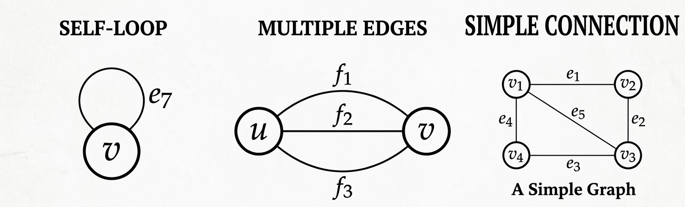

Unless specified otherwise, standard graph theory problems assume a graph is **simple**.

---

## Vertex Degrees and Handshaking

### Vertex Degree

The **degree** of a vertex $v$, denoted by $d(v)$, is the number of edges incident to $v$. For simple graphs, it is equal to the number of neighbors connected to $v$.

*(Note: If a vertex has a self-loop, that loop contributes $2$ to the vertex's degree, as it touches the vertex twice.)*

#### Example 

```{example}

Using Example 1.1 above:

* $d(v_1) = 3$ (connected by $e_1, e_4, e_5$)
* $d(v_2) = 2$ (connected by $e_1, e_2$)
* $d(v_3) = 3$ (connected by $e_2, e_3, e_5$)
* $d(v_4) = 3$ (connected by $e_3, e_4, e_6$)
* $d(v_5) = 1$ (connected by $e_6$)

Summing all degrees: $3 + 2 + 3 + 3 + 1 = 12$. Notice that the total number of edges $\vert{}E\vert{}$ is $6$. The sum of degrees ($12$) is exactly twice the number of edges ($2 \times 6$).
```
---

### The Handshaking Lemma

This observation holds true for all graphs.

```{theorem,name="Handshaking Lemma"}

Let $G = (V, E)$ be any graph. Then the sum of the degrees of all vertices is equal to twice the number of edges:


$$\sum_{v \in V} d(v) = 2\vert{}E\vert{}$$
```
```{proof}
*Intuition:*

Every edge $e = (u, v)$ has two endpoints. When we count the degree of vertex $u$, edge $e$ contributes $1$. When we count the degree of vertex $v$, edge $e$ contributes $1$ again. Therefore, every edge contributes exactly $2$ to the sum total of degrees in the graph.
```

```{corollary,name="The Parity of Odd-Degree Vertices"}

In any graph $G$, the number of vertices that have an **odd degree** must be **even**.
```

```{proof}

Partition the vertex set $V$ into two subsets: $V_{\text{even}}$ (vertices with even degree) and $V_{\text{odd}}$ (vertices with odd degree).

$$\sum_{v \in V} d(v) = \sum_{v \in V_{\text{even}}} d(v) + \sum_{v \in V_{\text{odd}}} d(v) = 2\vert{}E\vert{}$$

1. The total sum $2\vert{}E\vert{}$ is always an even integer.
2. The sum $\sum_{v \in V_{\text{even}}} d(v)$ is a sum of even integers, so it must be even.
3. For the equation to balance, the sum $\sum_{v \in V_{\text{odd}}} d(v)$ must also be **even**.
4. A sum of odd integers is even if and only if there is an **even number** of odd integers.

Thus, the number of vertices with odd degree is always even.
```

---

## Special Classes of Graphs

Certain graph structures appear frequently throughout graph theory and computer science applications.

### Complete Graphs ($K_n$)

```{definition}
A **complete graph** on $n$ vertices, denoted by $K_n$, is a simple graph in which every pair of distinct vertices is connected by an edge.
```


* **Number of Edges in $K_n$**:
To find the total number of edges, we count how many ways we can pick a pair of vertices from $n$ available vertices:

$$\vert{}E\vert{} = \binom{n}{2} = \frac{n(n - 1)}{2}$$


### Regular Graphs

```{definition}
A graph is **$k$-regular** if every vertex has the same degree $k$.
```
* In a $k$-regular graph with $n$ vertices, $\sum d(v) = n \cdot k$. By the Handshaking Lemma:

$$n \cdot k = 2\vert{}E\vert{} \implies \vert{}E\vert{} = \frac{n \cdot k}{2}$$
<center>

</center>

* **Note**: A complete graph $K_n$ is an $(n - 1)$-regular graph.

### Bipartite Graphs

```{definition}
A graph $G = (V, E)$ is **bipartite** if its vertex set $V$ can be partitioned into two disjoint subsets, $V_1$ and $V_2$ ($V = V_1 \cup V_2$ and $V_1 \cap V_2 = \emptyset$), such that every edge in $E$ connects a vertex in $V_1$ to a vertex in $V_2$. No edges exist between two vertices within $V_1$ or within $V_2$.
```


#### Complete Bipartite Graphs ($K_{n_1, n_2}$)

A **complete bipartite graph** $K_{n_1, n_2}$ is a bipartite graph where every vertex in $V_1$ (with $\vert{}V_1\vert{} = n_1$) is connected to every vertex in $V_2$ (with $\vert{}V_2\vert{} = n_2$).

* Total Vertices: $\vert{}V\vert{} = n_1 + n_2$
* Total Edges: $\vert{}E\vert{} = n_1 \cdot n_2$

#### Characterization Theorem of Bipartite Graphs

How can we determine if a given graph is bipartite?

```{theorem}
A graph $G$ is bipartite **if and only if** it contains **no cycles of odd length**.
```

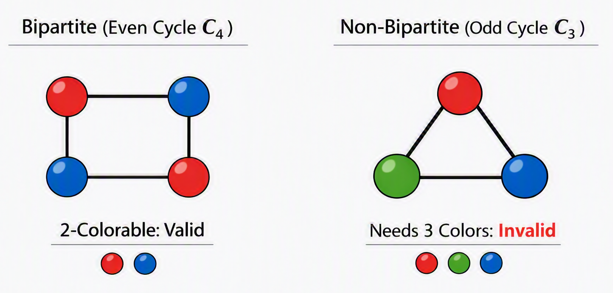

* If a graph contains a triangle ($C_3$), a pentagon ($C_5$), or any other cycle with an odd number of edges, it cannot be partitioned into two valid bipartite sets.

---

## Traversal Terminology: Walks, Trails, Paths, Circuits, and Cycles

To navigate through a graph, we need clear definitions for moving along vertices and edges.

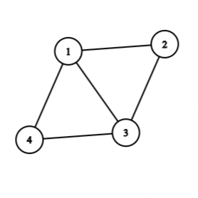


### Definitions

```{definition}
1. **Walk**: A sequence of alternating vertices and edges, starting at vertex $v_0$ and ending at $v_k$: $v_0, e_1, v_1, e_2, \dots, e_k, v_k$. Vertices and edges **may be repeated**.
2. **Trail**: A walk in which **no edge is repeated**. Vertices may still be repeated.
3. **Path**: A trail in which **no vertex is repeated**. (Consequently, no edge is repeated either).
4. **Closed Walk / Trail**: A walk or trail that starts and ends at the exact same vertex ($v_0 = v_k$).
5. **Circuit**: A **closed trail** (starts and ends at the same vertex, with no repeated edges).
6. **Cycle**: A **closed path** (starts and ends at the same vertex, with no repeated vertices other than the start and end).
```
### Summary Table

| Structure | Repeated Vertices Allowed? | Repeated Edges Allowed? | Start and End at Same Vertex? |
| --- | --- | --- | --- |
| **Walk** | Yes | Yes | Optional |
| **Trail** | Yes | **No** | Optional |
| **Path** | **No** | **No** | No |
| **Circuit** | Yes | **No** | **Yes** |
| **Cycle** | **No** (except start/end) | **No** | **Yes** |

---

## Directed Graphs (Digraphs)

In many real-world networks, connections are one-way streets. For example, a web page may link to another, but that page might not link back.

```{definition}
A **directed graph** (or **digraph**) consists of a vertex set $V$ and an edge set $E$ containing **ordered pairs** of vertices. An edge $e = (u, v)$ goes **from $u$ to $v$**.
```
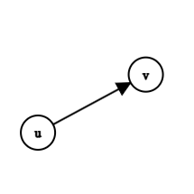

### In-Degree and Out-Degree

```{definition}
Because edges have direction in a digraph, we split vertex degree into two separate counts:

* **In-degree ($d_{\text{in}}(v)$)**: The number of directed edges coming **into** vertex $v$.
* **Out-degree ($d_{\text{out}}(v)$)**: The number of directed edges going **out of** vertex $v$.

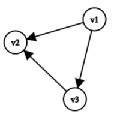
```

In the example above:

* $d_{\text{in}}(v_1) = 0$, $d_{\text{out}}(v_1) = 2$
* $d_{\text{in}}(v_2) = 2$, $d_{\text{out}}(v_2) = 0$
* $d_{\text{in}}(v_3) = 1$, $d_{\text{out}}(v_3) = 1$

#### Handshaking Lemma for Directed Graphs

```{theorem,name="Handshaking Lemma for Directed Graphs"}
In any directed graph, the sum of all in-degrees equals the sum of all out-degrees, which both equal the total number of directed edges:

$$\sum_{v \in V} d_{\text{in}}(v) = \sum_{v \in V} d_{\text{out}}(v) = \vert{}E\vert{}$$
```

---

## Chapter 1 Exercises

```{example}
1. **Degree Calculations**: A simple graph has 8 vertices and 14 edges. If 4 vertices have degree 4, and 3 vertices have degree 3, what is the degree of the remaining vertex?
2. **Bipartite Verification**: Prove or disprove whether a single cycle graph $C_6$ (a cycle with 6 vertices) is bipartite. What about $C_7$?
3. **Complete Graph Proof**: Use induction to show that the number of edges in a complete graph $K_n$ is given by $\frac{n(n-1)}{2}$.
4. **Handshaking Lemma**: Is it possible to construct a simple graph with 5 vertices such that their degrees are $3, 3, 3, 2, 1$? Explain using the Handshaking Lemma.
```